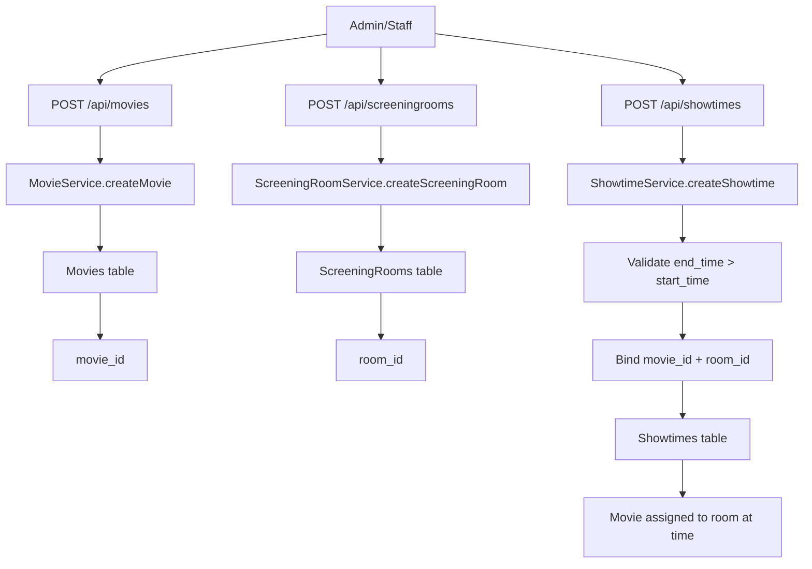

## Movie - Room - Showtime Business Flow

This document explains the practical flow for:
1. Creating a movie
2. Creating a screening room
3. Assigning a movie to a room at a specific time (create showtime)

It is based on the current controllers/services implementation.

---

## 1) Create Movie

- **API**
  - `POST /api/movies`
  - Controller: `MoviesController.createMovie`
  - Service: `MovieServiceImpl.createMovie`

- **Request shape**
  - Current endpoint accepts `MovieDto` directly (not `MovieRequestDto`).
  - Main fields used by service:
    - `title`
    - `description`
    - `genre`
    - `duration_minutes`
    - `age_rating`
    - `release_date`
    - `status`

- **Business behavior**
  - Service uses in-memory lock key:
    - `movie:create:{normalized_title}`
  - Maps DTO fields into `Movies` entity and saves.
  - Caches by `movie_id`.

- **Output**
  - Returns created `MovieDto` including `movie_id`.

---

## 2) Create Screening Room

- **API**
  - `POST /api/screeningrooms`
  - Controller: `ScreeningRoomsController.createScreeningRoom`
  - Service: `ScreeningRoomServiceImpl.createScreeningRoom`

- **Request shape**
  - Current endpoint accepts `ScreeningRoomDto` directly.
  - Important fields:
    - `room_name`
    - `amount_rows`
    - `amount_cols`
    - `cinema_id`

- **Business behavior**
  - Service validates payload is not null.
  - Uses in-memory lock key:
    - `screeningRoom:create:{cinema_id}:{normalized_room_name}`
  - Resolves cinema with `EntityManager.getReference(Cinemas.class, cinema_id)`.
  - Saves screening room and caches by `room_id`.

- **Output**
  - Returns created `ScreeningRoomDto` with `room_id`.

---

## 3) Assign Movie to Room at Time (Create Showtime)

- **API**
  - `POST /api/showtimes`
  - Controller: `ShowtimesController.createShowtime`
  - Service: `ShowtimeServiceImpl.createShowtime`

- **Request shape**
  - Current endpoint accepts `ShowtimeDto` directly.
  - Required business fields:
    - `movie_id`
    - `screening_room_id`
    - `start_time`
    - `end_time`
  - Optional:
    - `buffer_time`
    - `status`

- **Business behavior**
  - Service validates:
    - `end_time` must be after `start_time`.
  - Uses in-memory lock key:
    - `showtime:create:{movie_id}:{screening_room_id}:{start_time}`
  - Resolves references:
    - `Movies` by `movie_id` (reference)
    - `ScreeningRooms` by `screening_room_id` (reference)
  - Saves showtime and caches by `showtime_id`.

- **Output**
  - Returns created `ShowtimeDto` with `showtime_id`.

---

## End-to-End Example Sequence

1. Call `POST /api/movies` to create movie -> get `movie_id`.
2. Call `POST /api/screeningrooms` to create room -> get `room_id`.
3. Call `POST /api/showtimes` with:
   - `movie_id = <movie_id>`
   - `screening_room_id = <room_id>`
   - chosen `start_time` and `end_time`
4. Showtime is now the link: **movie + room + time**.

---

## Mermaid Flow

---

## Operational Notes (Current Implementation)

- APIs currently accept `*Dto` objects directly in request bodies.
- Locking is in-memory (`LockManager<String>`), using business-key lock names.
- The showtime service validates time ordering, but does **not** currently enforce overlap prevention between showtimes in the same room (if you need that, add conflict checks in `ShowtimeServiceImpl` + repository query).

